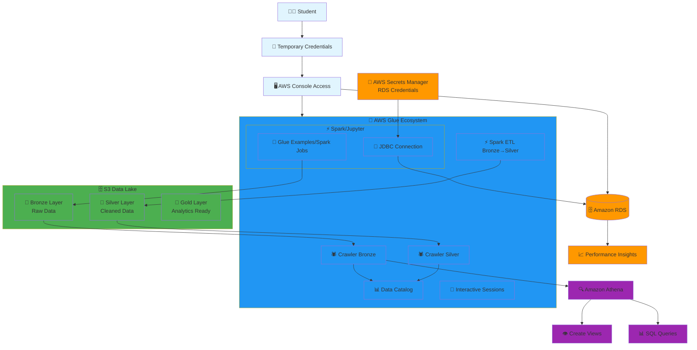

# IESB Big Data Infrastructure - Architecture Overview

## System Architecture Diagram

## Data Lake Methodology: Bronze, Silver, Gold Layers

### 🥉 Bronze Layer (Raw Data)
- **Purpose**: Store raw, unprocessed data exactly as extracted from source
- **Format**: Original format from RDS (JSON, Parquet, etc.)
- **Schema**: Minimal or no schema enforcement
- **Use Case**: Data archival, reprocessing, audit trail

### 🥈 Silver Layer (Cleaned Data)
- **Purpose**: Cleaned, validated, and standardized data
- **Format**: Optimized formats (Parquet, Delta)
- **Schema**: Enforced schema with data quality rules
- **Use Case**: Data science, feature engineering, reporting

### 🥇 Gold Layer (Analytics Ready)
- **Purpose**: Business-ready, aggregated data for analytics
- **Format**: Highly optimized for query performance
- **Schema**: Star/snowflake schema, dimensional modeling
- **Use Case**: BI dashboards, executive reporting, ML models

## Student Workflow

1. **Access**: Login with temporary credentials → Force password reset
2. **Development**: Upload Glue notebooks → Connect to RDS via JDBC
3. **Extraction**: Extract tables → Monitor with Performance Insights
4. **Processing**: Save to Bronze layer → Run Glue Crawlers
5. **Transformation**: Process Bronze → Silver → Gold layers
6. **Analytics**: Query with Athena → Create views → Explore data lake patterns

## Key Learning Objectives

- **Data Lake Architecture**: Understanding layered approach to data storage
- **ETL/ELT Processes**: Hands-on experience with AWS Glue
- **Data Cataloging**: Automatic schema discovery with Glue Crawlers
- **Analytics**: SQL querying with Athena across different data layers
- **Performance Monitoring**: Database performance analysis with RDS Performance Insights
