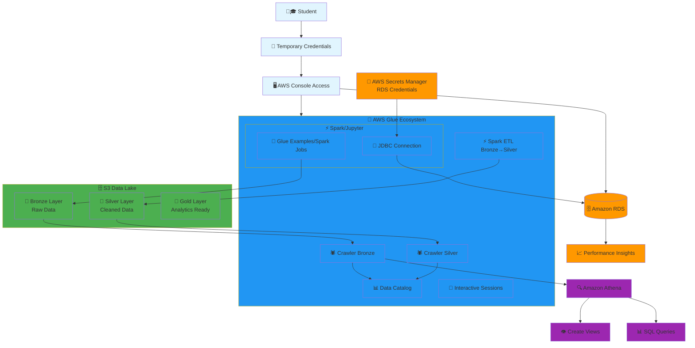

# IESB Big Data Infrastructure

This repository contains the infrastructure code for the IESB Big Data class, including Terraform configurations for AWS services and supporting scripts.

## Architecture Overview

### System Architecture Diagram



### Simple Data Flow

```
👨🎓 Student Login (Temp Creds) 
    ↓
🖥️ AWS Console Access
    ↓
┌─────────────────────────────────┐
│     🔧 AWS Glue Ecosystem       │
│  📓 Interactive Sessions        │
│  ┌─────────────────────────────┐ │
│  │   ⚡ Spark/Jupyter          │ │
│  │ 📝 Spark Jobs/Examples      │ │
│  │ 🔌 JDBC Connection          │ │
│  └─────────────────────────────┘ │
│  🕷️ Crawlers (Bronze/Silver)    │
│  📊 Data Catalog               │
│  ⚡ Spark ETL Transformations   │
└─────────────────────────────────┘
    ↓
🔐 Secrets Manager (RDS Creds) → 🗄️ RDS → 📈 Performance Insights
    ↓
┌─────────────────────────────────┐
│        🗄️ S3 Data Lake          │
│  🥉 Bronze Layer (Raw Data)     │
│  🥈 Silver Layer (Clean Data)   │
│  🥇 Gold Layer (Analytics Ready)│
└─────────────────────────────────┘
    ↓ 
🔍 Athena Queries & Views
```

### Data Lake Layers

| Layer | Purpose | Format | Use Case |
|-------|---------|--------|----------|
| 🥉 Bronze | Raw data storage | Original format | Archive, reprocess |
| 🥈 Silver | Cleaned & validated | Parquet/Delta | Data science, reports |
| 🥇 Gold | Business ready | Optimized schema | BI, ML, analytics |

## Project Structure

```
├── docs/                    # Documentation
├── infrastructure/          # Infrastructure as Code
│   ├── terraform/          # Terraform configurations
│   └── scripts/            # Infrastructure management scripts
├── examples/               # Code examples and tutorials
│   ├── glue/              # AWS Glue examples
│   └── notebooks/         # Jupyter notebooks
├── testing/               # Test suites
│   ├── unit/              # Unit tests
│   └── integration/       # Integration tests
└── deployment/            # Deployment configurations
    ├── airflow/           # Apache Airflow setup
    └── metabase/          # Metabase deployment
```

## What This Infrastructure Creates

### IAM
- 18 student users created dynamically and added to a new IAM Group
- Console access with temporary passwords (force reset on first login)
- Programmatic access (optional) via access keys
- Group policies granting full access to the Glue ecosystem and class S3 bucket

### DynamoDB
- Table to store initial login materials (username, temp console password, optional access keys)
- SSE-KMS encrypted, with least-privilege write access from Terraform only

### S3
- One class bucket (e.g., iesb-bigdata-<suffix>) that the student group can fully access

### Glue
- Glue job (Spark) that reads from Amazon RDS using Secrets Manager secret (rds-secret)
- Writes output to the S3 bucket
- Glue service role with access to the secret, class bucket, CloudWatch logs, and Glue resources

## Prerequisites

- AWS CLI configured
- Terraform installed
- Python 3.x with required packages (see requirements.txt)

## Quick Start

1. Configure your AWS credentials
2. Update `infrastructure/terraform/terraform.tfvars` with your specific values
3. Run `terraform init` and `terraform apply` in the `infrastructure/terraform/` directory
4. Use scripts in `infrastructure/scripts/` directory for user management

## Testing

- Unit tests: `cd testing/unit && python run_tests.py`
- Integration tests: Run tests from `testing/integration/` directory

## Documentation

See `docs/` directory for detailed documentation and guides.

## Security Note

⚠️ Storing plaintext temp passwords in DynamoDB is inherently sensitive. This setup:
- Forces password reset at first login
- Encrypts the table with KMS
- Limits who can read the table (by default, only admins)

Prefer distributing credentials over secure channels and deleting rows after students log in.
